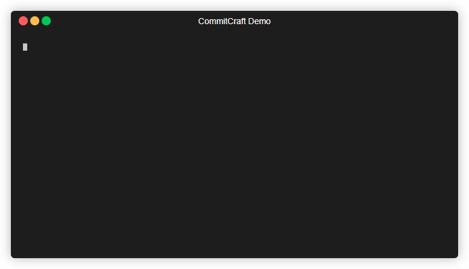

# CommitCraft - AI commit generator

AI-based commit generator that turns your staged diff into clean, conventional, and detailed commits in an instant.




## Introduction

We all hate writing commit messages like:

- "fix"
- "final final fix"
- "update file"

CommitCraft is capable of generating **clean, readable, meaningful commit messages automatically** based on your staged changes

## Features

- Reads your **staged files** from Git  
- Generates **AI-powered commit messages** using your OpenRouter key  
- Automatically commits each file with a relevant message  
- Easy one-command setup and use
  
## Before:


## After:


## ⭐ Support CommitCraft :3
If this tool saved you time (or your sanity), please 🌟 the repo it keeps me going :p 

## Installation

1. Install the package

``` bash
npm install -g commitcraft-ai
```

2. Then set your API key (i got myself one from OpenRouter.ai)

``` bash
npx commitcraft-setup
```

## Usage
3. Stage your files:

```bash
git add .
```
3. Use the AI-powered version!! (--ai or dont use a flag at all for rule based version)
``` bash
commitcraft --ai
```

4. Accept the suggested commit message by pressing Enter


## Roadmap
- [x] Add AI-powered commit suggestions
- [ ] Git hook integration
