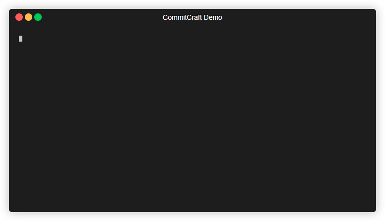

# CommitCraft - AI commit generator

AI-based commit generator that turns your staged diff into clean, conventional, and detailed commits in an instant.




## Introduction

We all hate writing commit messages like:

- "fix"
- "final final fix"
- "update file"

this is capable of generating **clean, readable, meaningful commit messages automatically** based on your changes

## Features

- **Auto stage + commit + push (one command workflow) - ```commitcraft push --ai```**
- **PR message generator - ```commitcraft pr```** (creates polished Pull Request descriptions from recent commits)
- **Undo last commit- ```commitcraft undo```** (reverts to previous commit safely)
- Reads your **staged files** from Git  
- **AI-powered commit messages** using your OpenRouter key  
- commits each file with a relevant message
- conventional commits format
- Easy setup and use
- Works in any repo

## Installation

1. Install the package

``` bash
npm install -g commitcraft-ai
```

2. Then set your API key (i got myself one from OpenRouter.ai)

``` bash
commitcraft-setup
```

## Usage
3. START USING!!!:

```bash
commitcraft push --ai
```

4. BOOM NOW JUST CLICK ENTER
  
## Before:


## After:


## Roadmap
- [x] Add AI-powered commit suggestions
- [ ] Git hook integration
- [ ] SINGLE CLICK WORFLOW
- [ ] Interactive commit message refinement mode


## ⭐ Support CommitCraft
if this tool saved you time (or your sanity at all), a star on the repository is appreciated- it helps others discover the project :3

##  🤝 Contributing
If you’d like to report a bug, request a feature, or open a PR, please create an issue first so we can discuss the approach.

## License
MIT License

Copyright (c) 2025 Sukhdev Thukral

See the LICENSE file for details.
